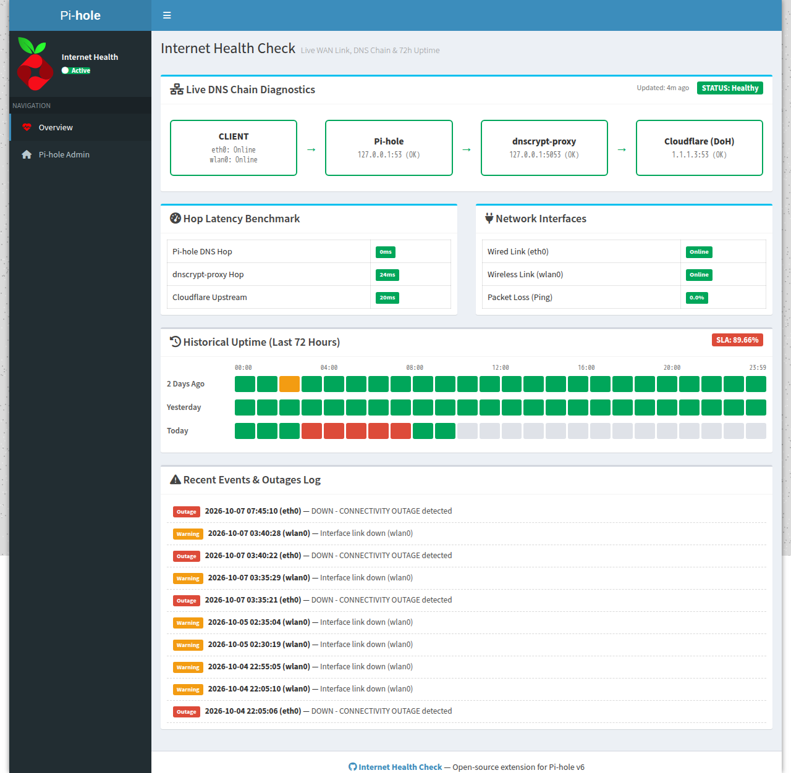

# Internet Health Check

Lightweight Bash and telemetry monitor for internet connectivity and DNS chain health on Linux, Raspberry Pi OS, and macOS. Features a native Pi-hole v6 AdminLTE web dashboard, zero-disk-wear RAM state tracking, 72-hour historical SLA grid, and real-time CLI diagnostics.

[](https://github.com/psinx/InternetHealthCheck/releases)
[](LICENSE)

---

## Quick Start

```bash
# Interactive check with visual terminal output
./internet_health_check.sh

# Syslog format to stdout
./internet_health_check.sh --format log

# Client check against remote Pi-hole (bypasses dnscrypt hop)
./internet_health_check.sh --pihole-host 192.168.1.2 --skip-dnscrypt

# Run automated test suite
./tests/test_internet_health_check.sh
```

---

## Prerequisites

* **Linux (Raspberry Pi OS / Debian / Ubuntu)**:
  ```bash
  sudo apt-get install -y bash curl dnsutils iproute2 iputils-ping python3
  ```
* **macOS**: Built-in system tools (`ping`, `dig`, `ifconfig`, `scutil`, `python3`) are supported out-of-the-box.

---

## Installation

### Pi-hole Server (Production)

1. **Clone the repository:**
   ```bash
   git clone https://github.com/psinx/InternetHealthCheck.git InternetHealthCheck
   cd InternetHealthCheck
   chmod +x internet_health_check.sh tests/test_internet_health_check.sh
   ```

2. **Deploy web assets:**
   ```bash
   sudo cp -f templates/index.html /var/www/html/index.html
   sudo cp -f templates/app.js /var/www/html/app.js
   ```

3. **Configure cron automation:**
   Edit crontab (`crontab -e`) to poll every 5 minutes (replace `/path/to` with your cloned repository path):
   ```bash
   */5 * * * * /path/to/InternetHealthCheck/internet_health_check.sh --reduce-disk-wear --html-file /var/www/html/index.html --log-file /path/to/InternetHealthCheck/logs/internet_health.log >/dev/null 2>&1
   ```

   * **Disk wear protection (`--reduce-disk-wear`)**: High-frequency states are buffered in RAM (`/dev/shm/internet_health_history.txt`). Redundant `OK` entries are suppressed, writing to disk only during outages, state transitions, or 24-hour heartbeats to maximize SD card lifespan.
   * **Concurrency control**: Guarded automatically via non-blocking POSIX `flock`.

### Client Workstation (macOS / Linux)

Run health checks against a remote Pi-hole over LAN:
```bash
git clone https://github.com/psinx/InternetHealthCheck.git InternetHealthCheck
cd InternetHealthCheck
./internet_health_check.sh --pihole-host 192.168.1.2 --skip-dnscrypt
```

---

## CLI Options

| Option | Argument | Description |
|---|---|---|
| `--reduce-disk-wear` | None | Buffer states in RAM (`/dev/shm`); write to disk only on state transitions or outages |
| `--html-file` | `FILE` | Generate `status.json` and deploy web assets to target directory |
| `--log-file` | `FILE` | Persistent disk log path (default: stdout or `logs/internet_health.log`) |
| `--interfaces` | `IFACES` | Comma-separated list of interfaces to monitor (default: auto-detected) |
| `--pihole-host` | `HOST` | Pi-hole host/IP to query (default: `127.0.0.1` on Linux, LAN resolver on macOS) |
| `--dnscrypt-host` | `HOST` | dnscrypt-proxy host/IP to query (default: `127.0.0.1`) |
| `--skip-dnscrypt` | None | Skip dnscrypt-proxy hop (recommended for client checks) |
| `--upstream-dns` | `IP` | Upstream DNS server to query (default: auto-detected or `1.1.1.3`) |
| `--format` | `pretty\|log` | Output format: `pretty` (visual checklist) or `log` (timestamped syslog) |
| `-h`, `--help` | None | Display help message |

---

## Dashboard



* **Single-Pass Telemetry**: Compiles `status.json` in a single run; frontend polls asynchronously every 30 seconds with relative freshness tickers.
* **Auto Theme**: Automatically switches between dark and light themes following system `prefers-color-scheme`.
* **Clean UI**: Semantic AdminLTE status badges without unicode symbol clutter.

---

## Testing

Run the automated test suite (26 assertions covering DNS chains, lock contention, RAM fallback, and telemetry generation):

```bash
./tests/test_internet_health_check.sh
```

---

## Releases

Detailed release notes and changelog are available on [GitHub Releases](https://github.com/psinx/InternetHealthCheck/releases).

---

## License

This project is licensed under the [MIT License](LICENSE).
